## 任务1：Monge矩阵的性质证明

### 证明1

#### 求证

若一$m*n$的矩阵$A$满足以下不等式
$$
A(i,j)+A(i+1,j+1)\le A(i,j+1)+A(i+1,j),\forall 1 \le i < m,1 \le j < n
$$
则A为Monge矩阵。

#### 证明

首先证明对于矩阵的所有行，有
$$
A(i,j)+A(x,j+1) \le A(i,j+1) + A(x,j),\forall 1 \le i < m,1 \le j < n,i+1\le x \le m \tag{a}
$$
已知当$x=i+1$时，不等式成立。

假设$x=k,i+1\le k \le m$时不等式成立，即
$$
A(i,j)+A(k,j+1) \le A(i,j+1) + A(k,j) \tag{1}
$$
由已知得
$$
A(k,j)+A(k+1,j+1) \le A(k,j+1) + A(k+1,j) \tag{2}
$$
$(1)+(2)$，得
$$
A(i,j)+A(k,j+1)+A(k,j)+A(k+1,j+1) \le A(i,j+1) + A(k,j) + A(k,j+1) + A(k+1,j)
$$
两边消项得
$$
A(i,j) + A(k+1,j+1) \le A(i,j+1) + A(k+1,j)
$$
可得当$x=k+1$时不等式成立。

因此不等式$(a)$对任意$i+1 \le x\le m$成立。

移项可得
$$
A(i,j)-A(i,j+1)\le A(x,j)-A(x,j+1)\\
A(i,j+1)-A(i,j+2)\le A(x,j+1)-A(x,j+2)\\
A(i,j+2)-A(i,j+3)\le A(x,j+2)-A(x,j+3)\\
\dotsm \\
A(i,y-1)-A(i,y)\le A(x,y-1)-A(x,y)\\
$$
以上不等式相加，得
$$
A(i,j)-A(i,y)\le A(x,j)-A(x,y)
$$
即
$$
A(i,j)+A(x,y)\le A(i,y)+A(x,j)
$$
得证矩阵$A$为Monge矩阵。

### 证明2

#### 求证

如果矩阵$A$是Monge矩阵，则它的转置$A^{'}$也是Monge矩阵。

#### 证明

记矩阵$A$的转置矩阵$A^{'}=B$，根据转置矩阵的定义有$A(i,j)=B(j,i)$。

因为$A$为Monge矩阵，则有
$$
A(i,j)+A(k,l)\le A(i,l)+A(k,j)
$$
代入$A(i,j)=B(j,i)$，可得
$$
B(j,i)+B(l,k)\le B(l,i)+B(j,k)
$$
根据Monge矩阵的定义证得$B$为Monge矩阵。

## 任务2：Monge矩阵的验证和生成

### 生成Monge矩阵

由任务1中Monge矩阵的等价定义可得
$$
A(i,j+1)-A(i,j) \ge A(i+1,j+1)-A(i+1,j)
$$
由此可知，Monge矩阵中的每相邻两列中，相同行的两个数的差分$\Delta a = A(i,j+1)-A(i,j)$关于行数$i$递减。只要矩阵满足上述条件，即为Monge矩阵。因此从该性质出发编写Monge矩阵的验证函数isMonge(A)和生成函数genMonge(m,n)。

为生成元素为自然数的$m*n$的Monge矩阵，

1. 用rand​和​round​函数随机生成矩阵$A$的第一列和$A$所有相邻列的差分矩阵rand\_diff​，差分矩阵的随机范围为[-15,15]。
2. 根据相邻两列差分递减的性质，将差分矩阵的每列元素降序排序。
3. 利用cumsum函数，将矩阵A的第一列加上累积差分得到剩余$n-1$列，最终生成Monge矩阵A。
4. 由于要求元素均为自然数，检验$A$中是否存在负数，若存在则对$A$的所有元素加上最小的负数的绝对值和一随机数（为避免随机生成的大部分矩阵都有一个元素为0​）。

算法正确性检验采用isMonge(A)函数（见verify_genMonge.m），取算例 $m=50,100,\cdots,500$，每个对应的m下n的大小取m的$0.6,1,1.4$倍，每个$m*n$的矩阵随机生成20个算例检验，共测试600个算例，检验结果证明了genMonge(m,n)生成的均为Monge矩阵，通过正确性检验。

## 任务3：Monge矩阵与优化

该任务要求利用Monge矩阵的特殊性质（monotone）来优化最基本的通用最小元素搜索算法。

### 通用最小元素搜索

最基本的最小元素搜索算法，采用两层循环实现，时间复杂度为 $O(mn)$。（算法对应函数参见getMin0.m）

### Monge矩阵最小元素搜索

#### 算法思路

算法实现思路如下（算法对应函数参见getMin1.m）：

Step1：从第一行第一列开始，搜索该行（列）上的最小元素

Step2：记录当前行（列）最小元素的位置和值，更新记录每次迭代产生候选最小元素的列表

Step3：根据记录的行（列）最小元素的列（行）索引，确定下一次搜索的行与列

Step4：重复Step1、2、3，直至搜索区域缩小至一行/一列/一个元素

Step5：记录当前搜索区域的最小元素的位置和值，更新记录候选最小元素的列表。至此，矩阵搜索结束

Step6：在候选最小元素列表中找到最终的最小元素，输出对应的行列索引

#### 复杂度

按照任务提供的思路，在最好的情况下，算法复杂度可以达到$O(m+n)$。在最差的情况下，即Monge矩阵$A_{m\times n}$第$i$行第$i$列（$i\leq \min(m,n)$）的最小元素均位于$(i,i)$位置时，可以计算时间复杂度如下（此处假设$m>n$，$m<n$同理）：
$$
\begin{aligned}
\text{计算次数}&=[m+n+(m-1)+(n-1)+\cdots+2+(n-m+2)+1+(n-m+1)]+m\\
&=\frac{m(m+1)}{2}+\frac{m(2n-m+1)}{2}+m\\
&=mn+2m
\end{aligned}
$$
因而时间复杂度最差为 $O(mn)$。

### 算法正确性测试

我们选取了MATLAB内置的min函数与find函数来验证算法的正确性，若二者输出最小元素的位置相同，可以认为算法输出结果正确。（测试脚本参见getMinVerify.m）

测试算例选取了随机生成的不同维数Monge矩阵$A_{m*n}$，其中$m=50,100,\cdots,500$，$(m-n=0,2,-2,5)$以及相同维数的多个Monge矩阵，累计共测试800个算例，所有算例的输出结果均与内置函数一致，可以证明算法的正确性。

需要说明，由于内置算法与自定义算法都是从上往下，从左往右遍历，当存在多个最小元素并存的情况时，二者都取第一个搜索到的最小元素坐标作为输出，因此在输出结果中没有出现预想的可能不一致的情况。

### 算法效率对比

根据上述复杂度的分析，可以知道该Monge矩阵最小元素搜索算法的时间复杂度介于最好的$O(m+n)$与最差的$O(mn)$之间，理论上整体性能优于通用最小元素算法。为了验证该结论，在其他条件相同的情况下，我们分别测试了不同维数Monge矩阵下两种算法求解所需时间及比较次数，以比较两种算法的效率。（测试脚本参见effTest.m）

> 说明：为了使双方的比较在公平情况下进行，所写的两个算法内部都没有使用内置min函数，而是都采用了循环语句；这也使得比较次数能够作为算法效率对比输出得参数成为可能。

#### 实验一：一般情况下的效率测试

##### 维数规模较大

测试算例选取了随机生成的不同维数Monge矩阵$A_{m*n}$，其中 $m=50,100,\cdots,500$，考虑方阵和非方阵，每个对应的m下n的大小取m的$0.4,0.6,1,1.4$倍，对每一确定的矩阵维数，各生成20个Monge矩阵，取这20个算例效率指标的平均值作为最终的输出结果。算例效率指标包括：算法求解时间与算法比较次数。得到结果如下：

<table>
    <tr>
        <td >
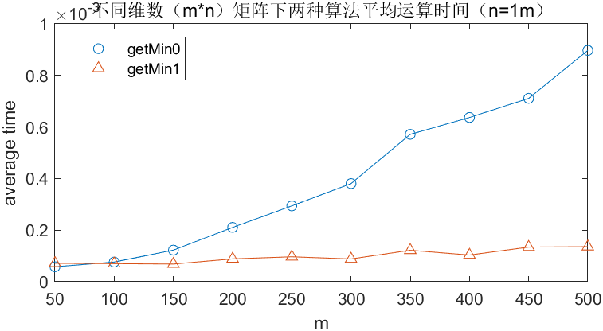 
</td>
        <td >
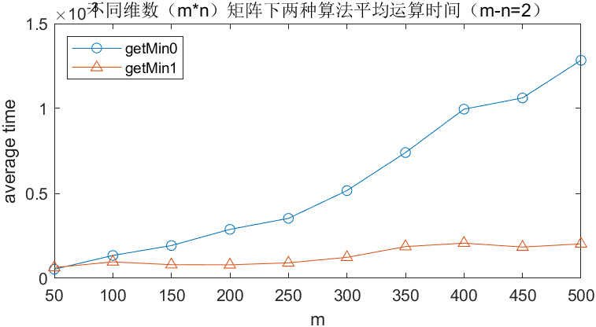 
</td>
    </tr>
    <tr>
        <td>
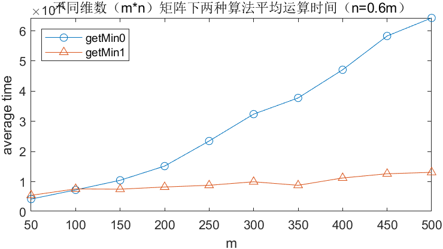 
</td>
        <td >
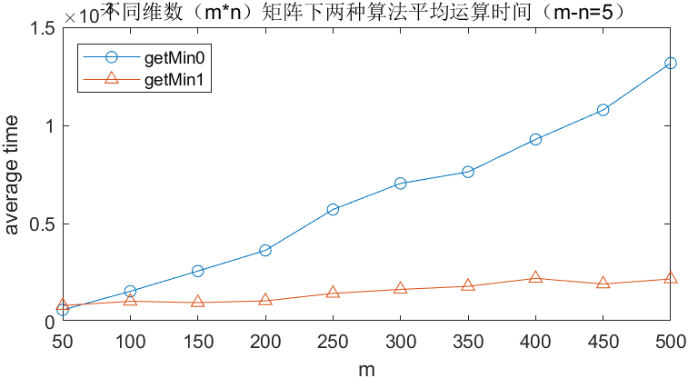 
 </td>
    </tr>
</table>
<table>
    <tr>
        <td >
 
</td>
        <td >
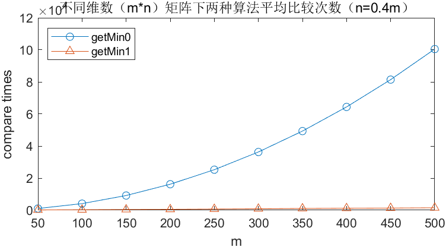 
</td>
    </tr>
    <tr>
        <td>
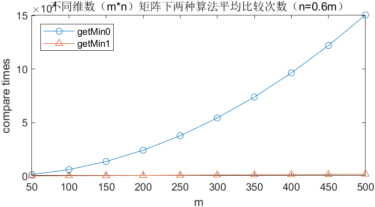 
</td>
        <td >
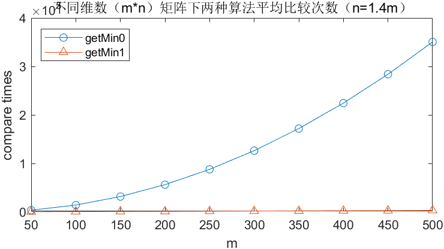 
 </td>
    </tr>
</table>
可以看出，对于不同维数下的Monge矩阵，算法的平均计算时间与比较次数都明显小于通用最小元素算法。同时，随着维数的增加，相比于通用算法，该算法寻找最小值过程中的元素比较次数没有发生显著的增加，只需要遍历很少的元素就可以得出结果，从而使得getmin1的时间效率相比之下大幅提高。该试验结果可以证实我们之前的结论，在维数大于100的范围内，该算法的整体效率要优于通用算法，维数量级越大优势越明显。

##### 维数规模较小

由于只取50和100进行试验不足以得到维数较小时算法的整体效率劣于通用算法的结论，为了确认上述实验的测试结果，并探究导致该现象的原因，针对维数在50-100之间的Monge矩阵，我们做了进一步的实验。

考虑将50-100细分为10组，取$m=50,55,\cdots,100$，其他条件不变，重新进行测试，得到结果如下：

<table>
    <tr>
        <td >
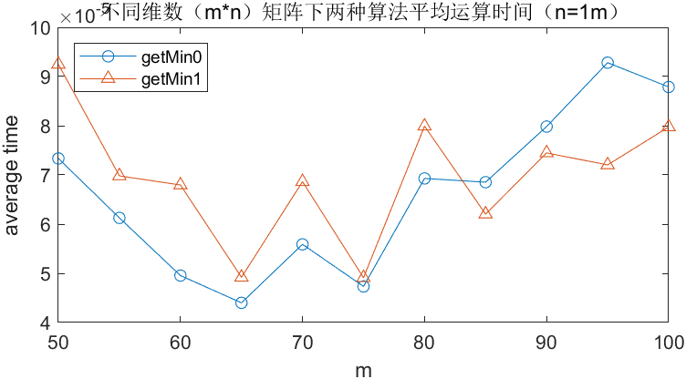 
</td>
        <td >
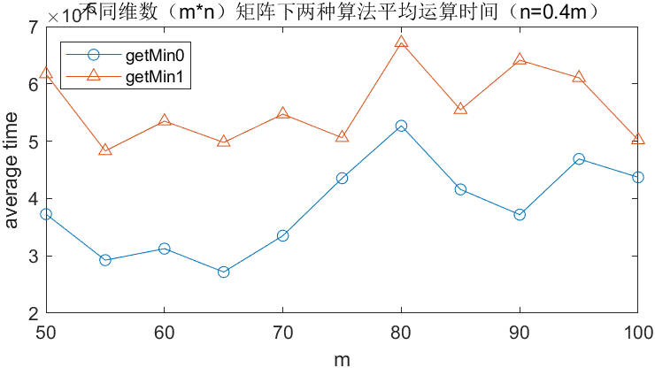 
</td>
    </tr>
    <tr>
        <td>
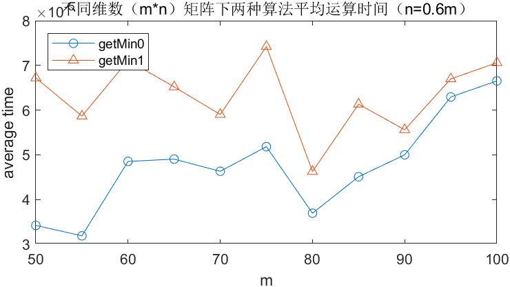 
</td>
        <td >
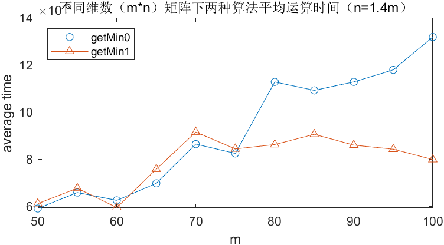 
 </td>
    </tr>
</table>

<table>
    <tr>
        <td >
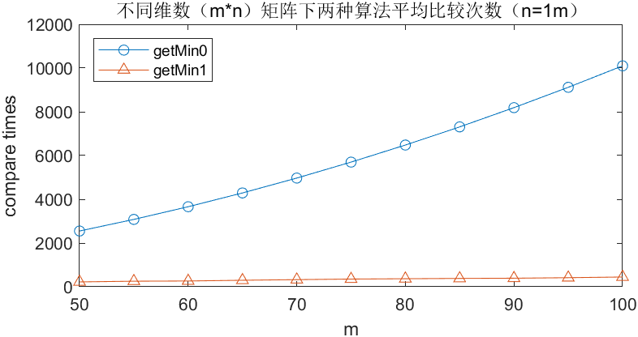 
</td>
        <td >
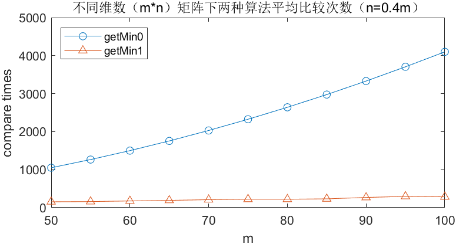 
</td>
    </tr>
    <tr>
        <td>
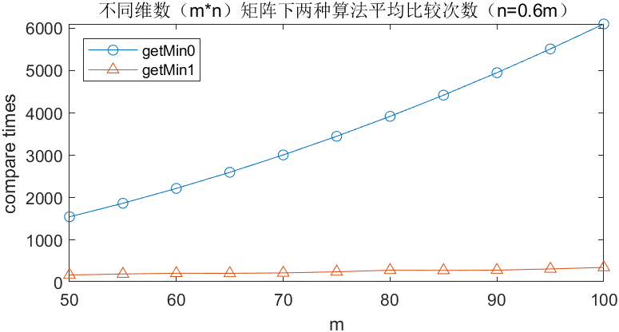 
</td>
        <td >
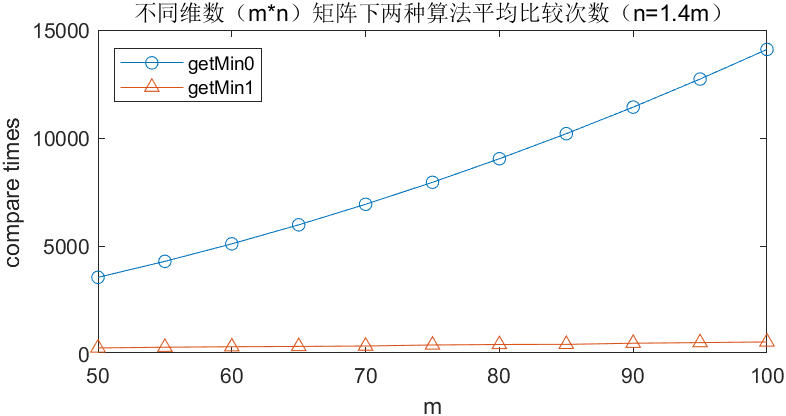 
 </td>
    </tr>
</table>

通过实验结果，可以看到在维数规模较小的情况下，通用算法的比较次数依然远大于该算法，但求解时间却出现了getMin1大于getMin0的情况。这与我们之前的实验结果一致，可以确认之前得到的结果是正确的。

特别的，可以观察到，在n=m与n=1.4m的两组实验中，当m超过某个值后，getMin1算法的运算时间开始小于getMin0，即当维数超过某个范围，算法整体效率开始处于优势。

我们推测，该现象的产生是由于维数较小区间内，减少比较次数带来的时间减少效应弱于内部算法结构复杂性带来的时间增加效应导致的。当维数较小时，getMin1通过减少比较次数降低的计算时间不足以抵消内部循环和条件判断较多导致增加的计算时间，导致计算时间整体增加，导致算法的优化效果并不明显。而随着维数的不断增加，getMin1相比getMin0节省的比较次数不断攀升，减少比较次数带来的计算时间减少效应逐渐占据上风，算法整体的优化效果也会越来越明显。

#### 实验二：最小元素均位于第一列情况下的效率测试

只使用行最小值列递增性质的算法在最小元素都位于第一列的情形下，每一行都需要遍历所有n列，复杂度会达到$O(mn)$。而由于Monge矩阵的转置仍为Monge矩阵，Monge矩阵有列最小值行递增的性质，若算法同时考虑行最小值列递增和列最小值行递增，能够巧妙避开这个问题，减少元素比较次数，提高算法效率。因此，在测试一般情况下以后，测试算例取最小元素都位于第一列的Monge矩阵，对比两种算法效率和比较次数。结果如下：

<table>
    <tr>
        <td >
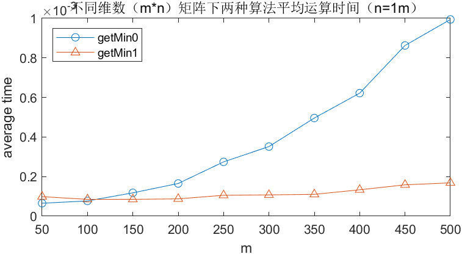 
</td>
        <td >
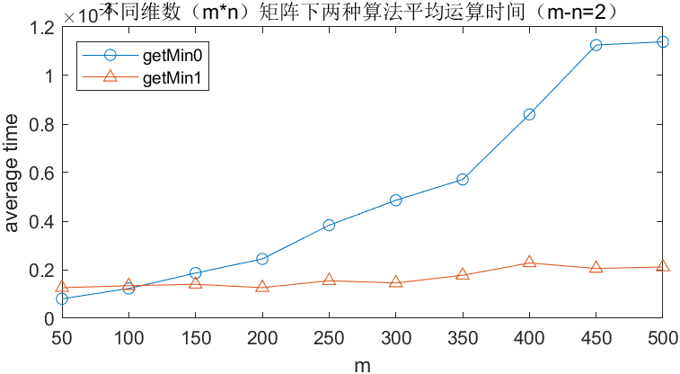 
</td>
    </tr>
    <tr>
        <td>
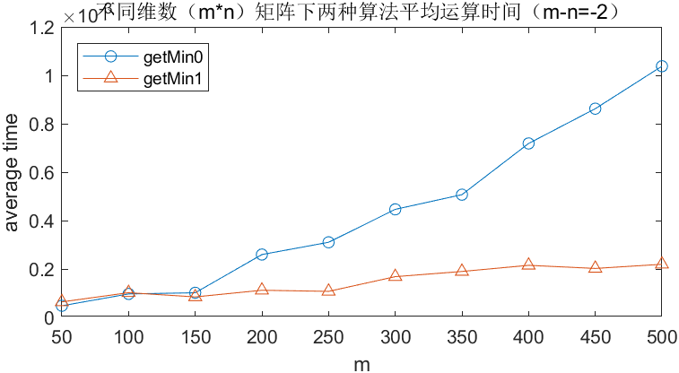 
</td>
        <td >
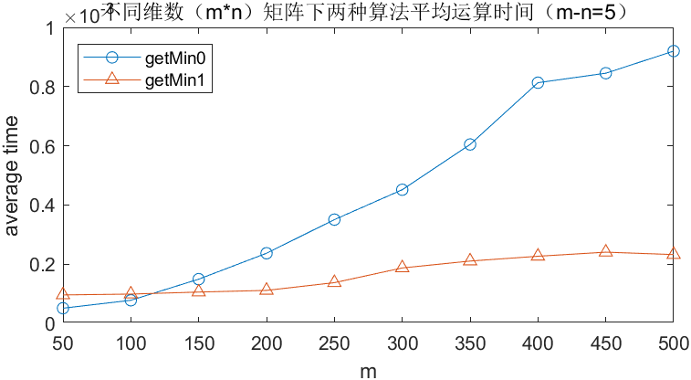 
 </td>
    </tr>
</table>
<table>
    <tr>
        <td >
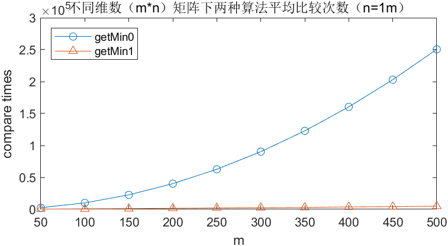 
</td>
        <td >
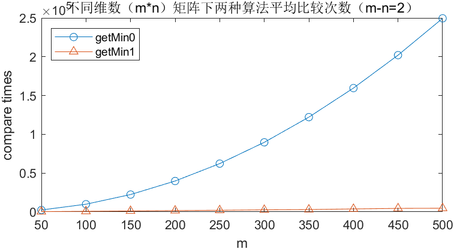 
</td>
    </tr>
    <tr>
        <td>
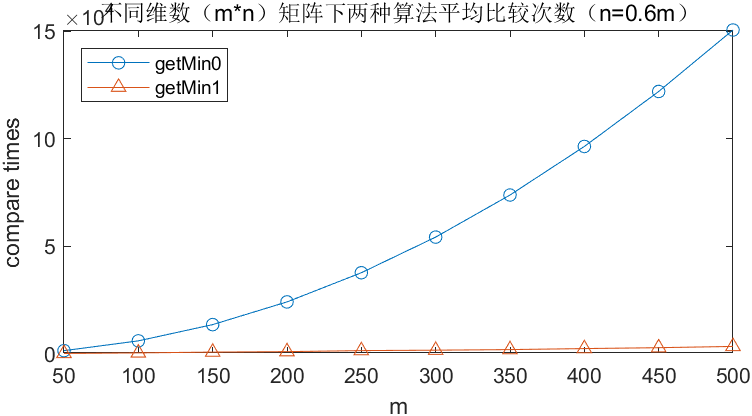 
</td>
        <td >
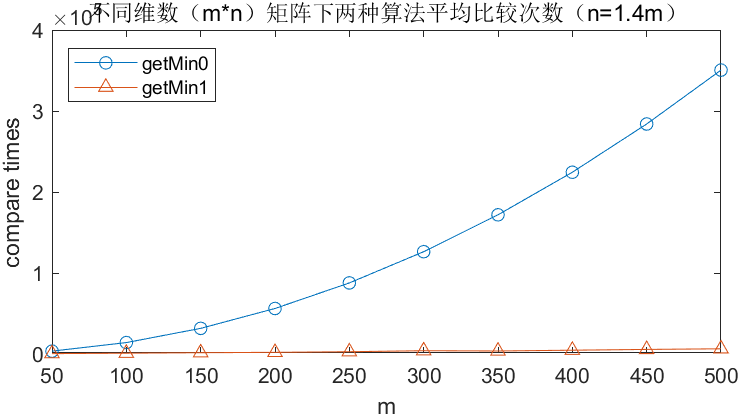 
 </td>
    </tr>
</table>
根据测试结果，虽然Monge矩阵的最小值都在第一列，但是实验对比结果和实验一的结果类似，该算法的平均计算时间与比较次数仍然都明显小于通用最小元素算法，且相比实验一，没有增加很多计算时间和比较次数。可以说明行列并用的算法相比只使用行最小值列递增性质的算法，整体效率会高很多。

#### 实验三：最差情况下的效率测试

此外，由于大多数情况下，随机生成的Monge矩阵都不会产生最差情况（最小元素都在左上角）的解，为了验证之间的复杂度差异，我们比较了最“不幸”的情况下两种算法的效率。

为了简化生成此类Monge矩阵的过程，我们考虑一种最简单的最差情形，即所有元素都相等的情况，由于每一行每一列在搜索最小元素时，在存在多个最小元素的情况下，默认会返回第一个最小元素，因此该特殊情况可以代表最差情形，重复上述的测试过程，得到结果如下：

<table>
    <tr>
        <td >
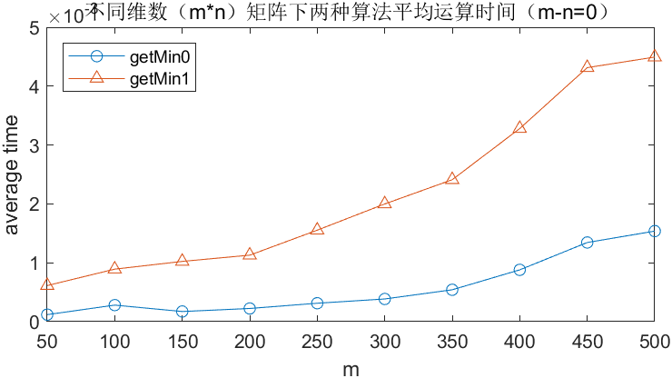 
</td>
        <td >
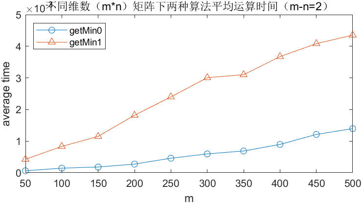 
</td>
    </tr>
    <tr>
        <td>
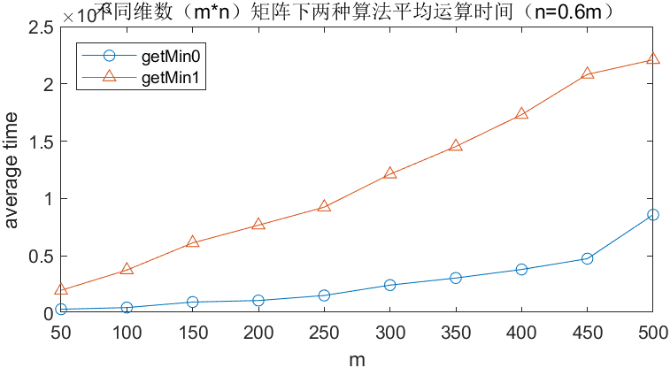 
</td>
        <td >
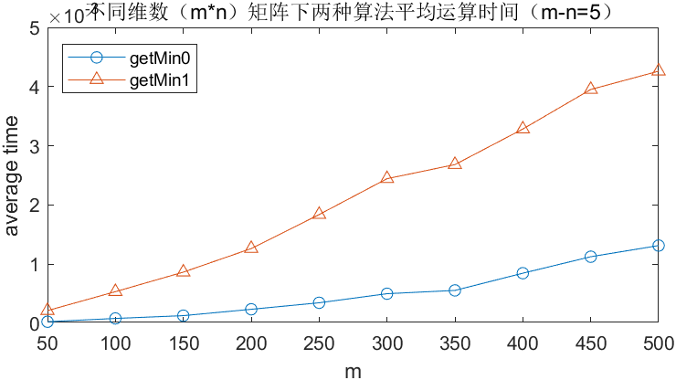 
 </td>
    </tr>
</table>
<table>
    <tr>
        <td >
 
</td>
        <td >
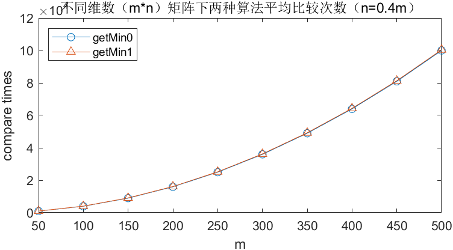 
</td>
    </tr>
    <tr>
        <td>
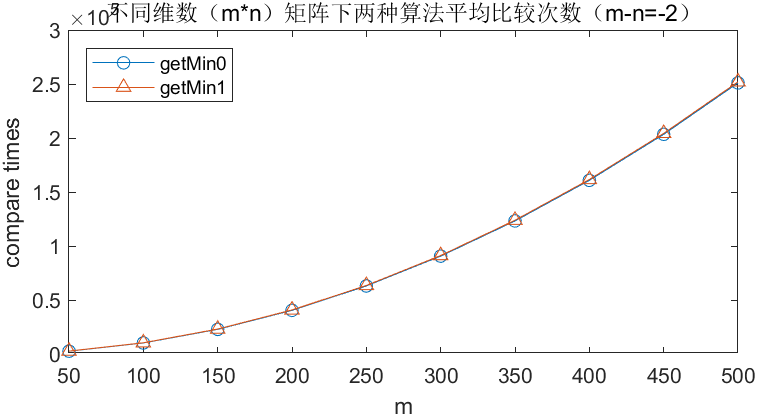 
</td>
        <td >
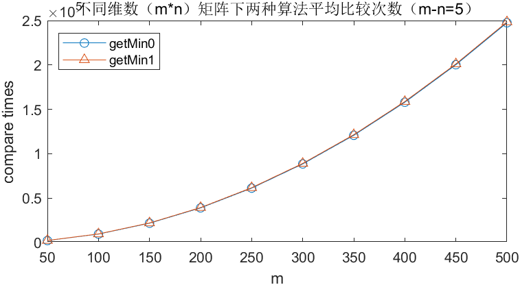 
 </td>
    </tr>
</table>
可以看出，在最差情况下，算法的平均比较次数与通用算法相同，可以证明我们之前给出的最差情形复杂度推导得到的结论，两种算法复杂度均为$O(mn)$；但同时我们也可以看到，getmin1使用的算法的平均求解时间要大于通用算法，我们推测这种情况是由于在比较次数相同的情况下，该算法中嵌套的循环更多，并且每次都需要判断元素位于左上角的情况导致的。